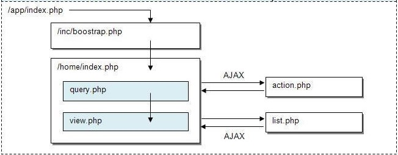

Application Structure
=====================

+---------------+-------------------------------------------------------------------------------------------+
| Directory     | Description                                                                               |
+===============+===========================================================================================+
| app           | This directory structure contains the application files and folders of your site.         |
|               | The directory is auto-bootstrapped with PHPLucidFrame environment.                        |
+---------------+-------------------------------------------------------------------------------------------+
| app/helpers   | The helpers mapping to the system core helpers should be placed in this directory         |
|               | directory. They are auto-loaded. For example, the custom validation helper                |
|               | (``validation_helper.php``) should be placed in this directory and it is auto-loaded      |
|               | across the site. The following helper files are allowed:                                  |
|               |                                                                                           |
|               | * ``auth_helper.php``                                                                     |
|               | * ``db_helper.php``                                                                       |
|               | * ``pager_helper.php``                                                                    |
|               | * ``session_helper.php``                                                                  |
|               | * ``utility_helper.php``                                                                  |
|               | * ``validation_helper.php``                                                               |
+---------------+-------------------------------------------------------------------------------------------+
| app/cmd       | The console command implementation should be placed in this directory. They are           |
|               | auto-loaded. For example, if you implement a custom command file ``GreetCommand.php``     |
|               | it should be placed in this directory and it is auto-loaded across the site.              |
+---------------+-------------------------------------------------------------------------------------------+
| app/entity    | This directory should be used to place the files which contains the business log          |
|               | functions or classes. They usually do the direct operations to the database layer.        |
+---------------+-------------------------------------------------------------------------------------------+
| app/inc       | The directory can include the site template files and site configuration file.            |
|               |                                                                                           |
|               | * ``/site.config.php`` (inherited by ``/inc/site.config.php``)                            |
|               | * ``/tpl/head.php`` (overridable by ``/inc/tpl/head.php``)                                |
|               | * ``/tpl/401.php`` (overridable by ``/inc/tpl/401.php``)                                  |
|               | * ``/tpl/403.php`` (overridable by ``/inc/tpl/403.php``)                                  |
|               | * ``/tpl/404.php`` (overridable by ``/inc/tpl/404.php``)                                  |
|               | * ``/tpl/header.php`` (overridable by ``/inc/tpl/header.php`` if you have)                |
|               | * ``/tpl/footer.php`` (overridable by ``/inc/tpl/footer.php`` if you have)                |
+---------------+-------------------------------------------------------------------------------------------+
| app/js        | The application javascript files should be placed in this directory.                      |
+---------------+-------------------------------------------------------------------------------------------+
| assets        | This directory contains all client resources such css, images, and js.                    |
+---------------+-------------------------------------------------------------------------------------------+
| assets/css    | This directory contains the application CSS files.                                        |
+---------------+-------------------------------------------------------------------------------------------+
| assets/images | This directory contains the images of the application.                                    |
+---------------+-------------------------------------------------------------------------------------------+
| assets/js     | This directory contains the system core javascript files which should not be hacked.      |
|               | Your application javascript files should be placed in ``/app/js``.                        |
+---------------+-------------------------------------------------------------------------------------------+
| business      | **[Deprecated]** This directory is deprecated and it is replaced by the directory         |
|               | ``/app/entity``                                                                           |
+---------------+-------------------------------------------------------------------------------------------+
| db            | This directory contains the database-related stuffs such as schema files,                 |
|               | seeding files, etc.                                                                       |
+---------------+-------------------------------------------------------------------------------------------+
| db/build      | This directory has the built schema definitions and it is ignored from version control.   |
+---------------+-------------------------------------------------------------------------------------------+
| db/generated  | This directory has the generated sql dump files and it is ignored from version control.   |
+---------------+-------------------------------------------------------------------------------------------+
| files         | This directory contains the files and folders of your site uploaded data. For example,    |
|               | sessions, photos, cache, etc.                                                             |
+---------------+-------------------------------------------------------------------------------------------+
| i18n          | This directory should be used to place ``.po`` language files, for example,               |
|               |                                                                                           |
|               | * ``en.po``                                                                               |
|               | * ``zh-CN.po``                                                                            |
+---------------+-------------------------------------------------------------------------------------------+
| i18n/ctn      | This directory should contain sub-directories to place custom multi-lingual content files.|
|               | For example,                                                                              |
|               |                                                                                           |
|               | * ``en/``                                                                                 |
|               |       * ``about-us.en``                                                                   |
|               |       * ``privacy-policy.en``                                                             |
|               | * ``zh-CN/``                                                                              |
|               |       * ``about-us.zh-CN``                                                                |
|               |       * ``privacy-policy.zh-CN``                                                          |
+---------------+-------------------------------------------------------------------------------------------+
| inc           | This directory structure contains the settings and configuration files of the application.|
|               | The following files are overwritable or inherited by the ``app/inc`` or                   |
|               | ``app/subsite/inc`` directory.                                                            |
|               |                                                                                           |
|               | * ``/site.config.php`` (inherited by ``/app/inc/site.config.php``)                        |
|               | * ``/tpl/head.php`` (overridable by ``/app/inc/tpl/head.php``)                            |
|               | * ``/tpl/401.php`` (overridable by ``/app/inc/tpl/401.php``)                              |
|               | * ``/tpl/403.php`` (overridable by ``/app/inc/tpl/403.php``)                              |
|               | * ``/tpl/404.php`` (overridable by ``/app/inc/tpl/404.php``)                              |
|               | * ``/tpl/header.php`` (overridable by ``/app/inc/tpl/header.php`` if you have)            |
|               | * ``/tpl/footer.php`` (overridable by ``/app/inc/tpl/footer.php`` if you have)            |
+---------------+-------------------------------------------------------------------------------------------+
| lib           | This directory is reserved for core library files. Custom and overwritten helpers should  |
|               | be placed in their own subdirectory of the ``app/helpers`` or ``app/{subsite}/helpers``   |
|               | directory sessions, photos, cache, etc.                                                   |
+---------------+-------------------------------------------------------------------------------------------+
| tests         | This directory should contain all test files. The directory is auto-bootstrapped with     |
|               | PHPLucidFrame environment.                                                                |
+---------------+-------------------------------------------------------------------------------------------+
| vendors       | This directory should be used to place downloaded and custom modules and third party      |
|               | libraries which are common to all sites.                                                  |
+---------------+-------------------------------------------------------------------------------------------+

Page Structure
--------------

PHPLucidFrame encourages a uniform and structural page organization. In brief, a page in LucidFrame is represented by a folder containing at least two files: ``index.php`` and ``view.php``. As an example, you can see the directory ``/app/home/`` of the LucidFrame release you downloaded. ::

    /path_to_webserver_document_root
        /phplucidframe
            /app
                /home
                    |-- action.php
                    |-- index.php
                    |-- query.php
                    |-- view.php

1. The **index.php** (required) serves as the front controller for the requested page, initializing the base resources needed to run the page.
2. The **action.php** (optional) handles form submission. It should perform form validation, create, update, delete of data manipulation to database. By default, a form is initiated for AJAX and ``action.php`` is automatically invoked if the action attribute is not given in the ``<form>`` tag.
3. The **query.php** (optional) should retrieve and process data from database and make it available to view.php.
4. The **view.php** (required) is a visual output representation to user using data provided by query.php. It generally should contain HTML between ``<body>`` and ``</body>``.
5. The **list.php** (optional) is a server page requested by AJAX, which retrieves data and renders HTML to the client. It is normally implemented for listing with pagination.

PHPLucidFrame is not bound to any specific directory structure, these are simply a baseline for you to work from.

Page Workflow
-------------

This illustration demonstrates a request to ``http://www.example.com`` or ``http://localhost/phplucidframe``.

Layout Mode
-----------

By default, PHPLucidFrame has two template files - ``header.php`` and ``footer.php``. They will have to include in every ``view.php``. Some developers may not want to have header and footer templates separately and not want to include the files in all views. They usually create a site layout file.

Since version 1.14, PHPLucidFrame provides a new feature to enable/disable layout mode globally or for a particular page.

Create a Layout File
^^^^^^^^^^^^^^^^^^^^

Create your layout file in ``/inc/tpl/`` or ``/app/inc/tpl/``. Default layout file name is ``layout.php``. ``<?php include _view(); ?>`` has to be called in the layout file. Here is an example layout file content: ::

    <!DOCTYPE html>
    <html>
    <head>
        <title><?php echo _title(); ?></title>
        <?php include _i('inc/tpl/head.php'); ?>
    </head>
    <body>
        

            

                

                    

                        <!-- header content -->
                    

                

                

                    

                        <?php include _view(); ?> <!-- page view -->
                    
 <!-- .container -->
                
 <!-- #page -->
                

                    

                        <!-- footer content -->
                     

                

            
 <!-- #page-container -->
        
 <!-- #wrapper -->
    </body>
    </html>

Enable Layout Mode globally
^^^^^^^^^^^^^^^^^^^^^^^^^^^

To enable layout mode globally, set true to ``$lc_layoutMode`` in ``/inc/config.php``. ::

    # $lc_layoutMode: Enable layout mode or not
    $lc_layoutMode = true;
    # $lc_layoutMode: Default layout file name
    $lc_layoutName = 'layout'; // layout.php

You can also configure ``$lc_layoutName`` using a custom file name other than ``layout.php``. Now that you have enabled the layout mode globally, ``query.php`` and ``view.php`` are automatically included for every page. ::

    /app
        /home
        |-- action.php
        |-- index.php
        |-- query.php (this file will be automatically included when layout mode is enabled)
        |-- view.php (this file will be automatically included when layout mode is enabled)

Enable Layout Mode for a Page
^^^^^^^^^^^^^^^^^^^^^^^^^^^^^

Assuming that you have ``$lc_layoutMode = false`` that makes layout mode disabled globally. If you want to enable it for a particular page. You can call ``_cfg('layoutMode', true);`` at the top of ``index.php`` of the page folder.

In addition, you can create a new layout for a particular page or a group of pages. You just need to call ``_cfg('layoutName', 'another-layout-file-name');`` for the pages. Check the example at ``/app/example/layout/index.php``.

Savant Integration
------------------

.. note:: ❖ PHPLucidFrame does not tie to any template system.

Savant is a powerful but lightweight object-oriented template system for PHP. Unlike other template systems, Savant by default does not compile your templates into PHP; instead, it uses PHP itself as its template language so you don't need to learn a new markup system. You can easily integrate it into LucidFame.

Check `the integration guide in the PHPLucidFrame wiki <https://github.com/phplucidframe/phplucidframe/wiki/Integration-of-Savant,-The-Simple-Template-System>`_.
