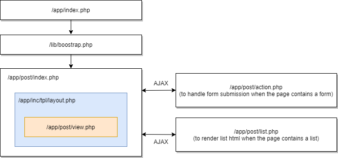

Application Structure
=====================

+----------------+------------------------------------------------------------------------------------------+
| Directory      | Description                                                                              |
+================+==========================================================================================+
| app            | This directory structure contains the application files and folders of your site.        |
|                | The directory is auto-bootstrapped with PHPLucidFrame environment.                       |
+----------------+------------------------------------------------------------------------------------------+
| app/helpers    | The helpers mapping to the system core helpers should be placed in this directory        |
|                | directory. They are auto-loaded. For example, the custom validation helper               |
|                | (``validation_helper.php``) should be placed in this directory and it is auto-loaded     |
|                | across the site. The following helper files are allowed:                                 |
|                |                                                                                          |
|                | * ``auth_helper.php``                                                                    |
|                | * ``db_helper.php``                                                                      |
|                | * ``file_helper.php``                                                                    |
|                | * ``pager_helper.php``                                                                   |
|                | * ``session_helper.php``                                                                 |
|                | * ``utility_helper.php``                                                                 |
|                | * ``validation_helper.php``                                                              |
+----------------+------------------------------------------------------------------------------------------+
| app/cmd        | The console command implementation should be placed in this directory. They are          |
|                | auto-loaded. For example, if you implement a custom command file ``GreetCommand.php``    |
|                | it should be placed in this directory and it is auto-loaded across the site.             |
+----------------+------------------------------------------------------------------------------------------+
| app/services   | This directory should be used to place the files which contains the business log         |
|                | functions or classes. They usually do the direct operations to the database layer.       |
+----------------+------------------------------------------------------------------------------------------+
| app/middleware | This directory should contain the files used for middleware.                             |
+----------------+------------------------------------------------------------------------------------------+
| app/inc        | The directory can include the site template files and site configuration file.           |
|                |                                                                                          |
|                | * ``/tpl/layout.php``                                                                    |
|                | * ``/tpl/401.php`` (overridable by ``/inc/tpl/401.php``)                                 |
|                | * ``/tpl/403.php`` (overridable by ``/inc/tpl/403.php``)                                 |
|                | * ``/tpl/404.php`` (overridable by ``/inc/tpl/404.php``)                                 |
|                | * ``/tpl/head.php`` (when layoutMode is disabled)                                        |
|                | * ``/tpl/header.php`` (when layoutMode is disabled)                                      |
|                | * ``/tpl/footer.php`` (when layoutMode is disabled)                                      |
+----------------+------------------------------------------------------------------------------------------+
| app/js         | The application javascript files should be placed in this directory.                     |
+----------------+------------------------------------------------------------------------------------------+
| assets         | This directory contains all client resources such css, images, and js.                   |
+----------------+------------------------------------------------------------------------------------------+
| assets/css     | This directory contains the application CSS files.                                       |
+----------------+------------------------------------------------------------------------------------------+
| assets/images  | This directory contains the images of the application.                                   |
+----------------+------------------------------------------------------------------------------------------+
| assets/js      | This directory contains the system core javascript files which should not be hacked.     |
|                | Your application javascript files should be placed in ``/app/assets/js``.                |
+----------------+------------------------------------------------------------------------------------------+
| db             | This directory contains the database-related stuffs such as schema files,                |
|                | seeding files, etc.                                                                      |
+----------------+------------------------------------------------------------------------------------------+
| db/build       | This directory has the built schema definitions and it is ignored from version control.  |
+----------------+------------------------------------------------------------------------------------------+
| db/generated   | This directory has the generated sql dump files and it is ignored from version control.  |
+----------------+------------------------------------------------------------------------------------------+
| files          | This directory contains the files and folders of your site uploaded data. For example,   |
|                | sessions, photos, cache, etc.                                                            |
+----------------+------------------------------------------------------------------------------------------+
| i18n           | This directory should be used to place ``.po`` language files, for example,              |
|                |                                                                                          |
|                | * ``en.po``                                                                              |
|                | * ``zh-CN.po``                                                                           |
+----------------+------------------------------------------------------------------------------------------+
| i18n/ctn       |                                                                                          |
|                | For example,                                                                             |
|                |                                                                                          |
|                | * ``en/``                                                                                |
|                | * ``about-us.en``                                                                        |
|                | * ``privacy-policy.en``                                                                  |
|                | * ``zh-CN/``                                                                             |
|                | * ``about-us.zh-CN``                                                                     |
|                | * ``privacy-policy.zh-CN``                                                               |
+----------------+------------------------------------------------------------------------------------------+
| inc            |                                                                                          |
|                | The following files are overridable or inherited by the ``app/inc`` or                   |
|                | ``app/subsite/inc`` directory.                                                           |
|                |                                                                                          |
|                | * ``/tpl/401.php`` (overridable by ``/app/inc/tpl/401.php``)                             |
|                | * ``/tpl/403.php`` (overridable by ``/app/inc/tpl/403.php``)                             |
|                | * ``/tpl/404.php`` (overridable by ``/app/inc/tpl/404.php``)                             |
+----------------+------------------------------------------------------------------------------------------+
| lib            | This directory is reserved for core library files. Custom and overwritten helpers should |
|                | be placed in their own subdirectory of the ``app/helpers`` or ``app/{subsite}/helpers``  |
|                | directory sessions, photos, cache, etc.                                                  |
+----------------+------------------------------------------------------------------------------------------+
| tests          | This directory should contain all test files. The directory is auto-bootstrapped with    |
|                | PHPLucidFrame environment.                                                               |
+----------------+------------------------------------------------------------------------------------------+
| vendor         | This directory should be used to place downloaded and custom modules and third party     |
|                | libraries which are common to all sites.                                                 |
+----------------+------------------------------------------------------------------------------------------+

Page Structure
--------------

PHPLucidFrame encourages a uniform and structural page organization. In brief, a web page in LucidFrame is represented by a folder containing at least one file: ``view.php`` or two files: ``index.php`` and ``view.php``. ::

    /path_to_webserver_document_root
        /acme
            /app
                /home
                    |-- view.php (required)
                    |-- index.php (optional)
                    |-- action.php (optional)
                    |-- list.php (optional)

1. The **view.php** (required) is a visual output representation to user using data provided by query.php. It generally should contain HTML between ``<body>`` and ``</body>``.
2. The **index.php** (optional) serves as the front controller for the requested page, initializing some basic resources and business logic needed to run the page. This is optional. ``view.php`` will be served as the front controller if ``index.php`` doesn't exist.
3. The **action.php** (optional) handles form submission. It should perform form validation, create, update, delete of data manipulation to database. By default, a form is initiated for AJAX and ``action.php`` is automatically invoked if the action attribute is not given in the ``<form>`` tag.
4. The **list.php** (optional) is a server page requested by AJAX, which retrieves data and renders HTML to the client. It is normally implemented for listing with pagination.

As an example, you can see the directory ``/app/home/`` and the directories under ``/app/example/`` of the PHPLucidFrame release you downloaded.

Directory and File Precedence
-----------------------------

PHPLucidFrame has directory and file precedence to look for when a page request is made. For example, a request to ``http://www.example.com/post`` or ``http://localhost/acme/post`` will look for the directory and file as the following order:

+-------+--------------------------+-----------------------------------------------------------------------------------------+
| Order | File                     | Description                                                                             |
+=======+==========================+=========================================================================================+
|    1. | /app/post/view.php       | when ``index.php`` doesn't exist in the ``post`` directory                              |
+-------+--------------------------+-----------------------------------------------------------------------------------------+
|    2. | /app/post/index.php      | when ``index.php`` and ``view.php`` eixst in the post directory                         |
+-------+--------------------------+-----------------------------------------------------------------------------------------+
|    3. | /app/post.php            | when there is no ``post`` directory with ``view.php``;                                  |
|       |                          | It is good for implementation without view presentation such as API response with json. |
|       |                          | ``post.php`` may end up with ``_json(array(...));``                                     |
+-------+--------------------------+-----------------------------------------------------------------------------------------+

Page Workflow
-------------

This illustration demonstrates a request to ``http://www.example.com/post`` or ``http://localhost/acme/post``.

Layout Mode
-----------

Since version 3.0, layout mode is enabled by default with the following two configurations in ``/inc/config.php``. ::

    # $lc_layoutMode: Enable layout mode or not
    $lc_layoutMode = true;
    # $lc_layoutMode: Default layout file name
    $lc_layoutName = 'layout'; // default layout file name pointed to app/inc/tpl/layout.php

You can see the default layout file ``app/inc/tpl/layout.php`` which contains the whole page HTML layout and its load the particular page view (``view.php``) by calling ``_app('view')->load()``.

You may have a separate layout file for a particular page, let's say for example, you have a login page which have a different layout other than the rest pages of the site. You can create a new layout file ``app/inc/tpl/layout_login.php``. ::

    /path_to_webserver_document_root
        /acme
            /app
                /inc
                    /tpl
                        |-- layout.php
                        |-- layout_login.php
                /login
                    |-- action.php
                    |-- index.php
                    |-- view.php

You can set the new layout name for login page in ``app/login/index.php`` such as ::

    _app('view')->layout = 'layout_login';

Then, the login page will use ``layout_login.php`` whereas the other pages use ``layout.php``.

Disabling Layout Mode
^^^^^^^^^^^^^^^^^^^^^

By disabling layout mode, you can have two template files - ``header.php`` and ``footer.php`` in ``app/inc/tpl``, and they will have to be included in every ``view.php`` explicitly. You can disable layout mode by adding the setting in ``app/inc/site.config.php``. ::

    # $lc_layoutMode: Enable layout mode or not
    $lc_layoutMode = false;

Then, you can include header and footer files by using ``_app('view')->block('fileName')`` in each ``view.php``. ::

    <?php _app('view')->block('header') ?>

    <!--- page stuffs here -->

    <?php _app('view')->block('footer') ?>

If you want to disable layout mode for a particular page only. You can add ``_cfg('layoutMode', false);`` at the top of ``index.php`` of the page folder.

.. note::
    - The disabled layout mode is a legacy way and not recommended since version 3.0. You can check the version 2 documentation about application structure at `<https://phplucidframe.readthedocs.io/en/v2.2.0/application-structure.html>`_
